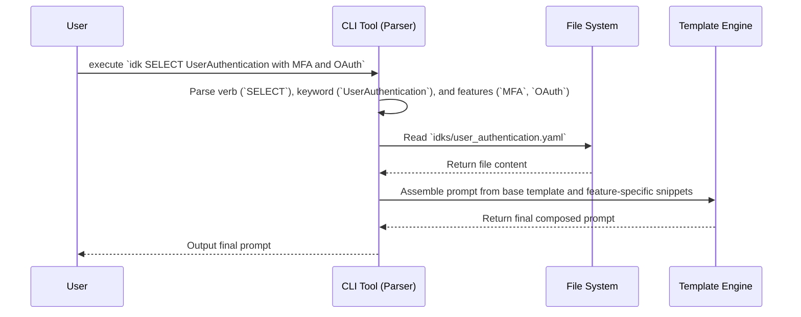

# ADR 001: IDK Expansion Engine with Natural Language Syntax

**Status**: Proposed

**Context**:

The initial implementation of the IDK project treated the IDK files as structured documentation. A subsequent proposal moved towards a simple `expand Keyword[param=value]` syntax. However, this approach is still too programmatic and does not fully align with the project's core goal of making human-AI communication more efficient and natural. The user's insight, drawing a parallel to the clear, powerful semantics of SQL keywords like `SELECT`, has prompted a re-evaluation.

**Decision**:

We will implement a CLI that uses a more natural, verb-based syntax for prompt construction. This engine will parse commands that resemble human language, making the system more intuitive and powerful.

The proposed syntax is:
`idk <VERB> <IDK_Keyword> [with <feature1>] [and <feature2>] ...`

The initial implementation will focus on the `SELECT` verb, which will be the primary action for generating a prompt.

**Example Usage**:
`idk SELECT UserAuthentication with MFA and OAuth`

This command is more readable and expressive than `idk expand UserAuthentication[withMFA=true, withOAuth=true]`.

**Implementation Plan**:

1.  **Simple Parser**: The CLI will use a simple parser based on keyword matching and string manipulation. It will not use a full-fledged NLP library in the initial implementation.
2.  **Intent and Entity Recognition**: The parser will identify the verb (intent) and the keyword and features (entities).
3.  **Compositional Engine**: The CLI will load the corresponding IDK YAML file and compose the final prompt by combining the base template with the snippets for the specified features.
4.  **IDK Schema**: The IDK YAML files will be updated to support this compositional approach. Each feature will have a corresponding `expands_to` snippet.

**Consequences**:

*   **Richer Interaction**: This approach moves beyond simple templating to a more compositional model of prompt engineering.
*   **Improved User Experience**: The syntax is more intuitive for developers, lowering the barrier to adoption.
*   **Increased CLI Complexity**: The CLI will require a more sophisticated parser to deconstruct the natural language query into a keyword and a set of features/parameters.
*   **Enhanced IDK Schema**: The YAML definitions will need to be updated to support this compositional approach. Each "feature" (e.g., `MFA`, `OAuth`) will correspond to a specific, combinable snippet of prompt text within the IDK definition.
*   **Extensibility**: This verb-based architecture provides a clear path for future expansion with new actions (e.g., `COMPARE`, `REFINE`, `TEST`).

## Sequence Diagram

